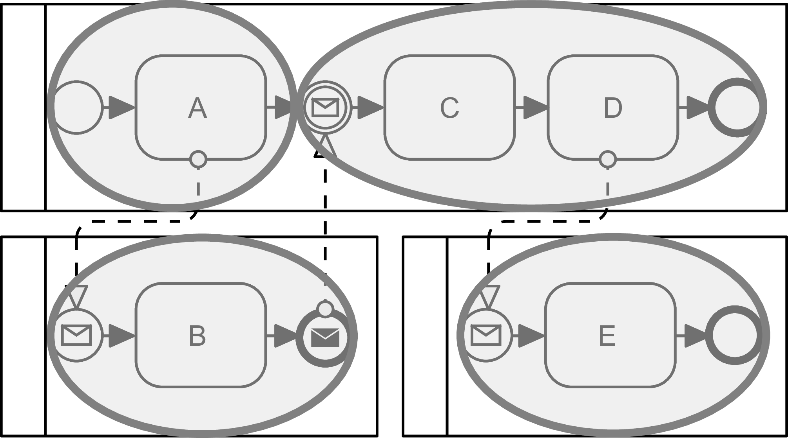

+++
title = "Assessment and Assurance"
type = "chapter"
weight = 4
+++

Assessment and assurance are both important parts of the design process. It addresses the evaluation of the Forensic Readiness Scenarios to determine the state of forensic readiness and the prioritisation for their enhancement. It also covers the techniques for validation of Forensic Readiness Requirements (i.e., whether they truly address the needs) and verifying their implementation (i.e., whether it is done correctly).

## Metrics

The Forensic Readiness Requirements describes a framework for using metrics for evaluating and verifying the requirements. However, specialised metrics are scoped on the Forensic Readiness Scenario. Based on BPMN4FRSS models, they can also be used for assessment purposes in the FR-ISSRM process .  First, the Scenario Coverage metric divides the model into components and computes a ratio of components covered by the potential evidence sources. Second, Relative Evidentiary Value approximates the quality of the evidence regarding its evidentiary value, i.e., how much it can be trusted. 

### Relative Evidentiary Value
Relative Evidentiary Value represents a quantitative estimate of evidentiary value placed on the Potential Evidence, within a Forensic Readiness Scenario, in terms of non-disputability. The metric considers the inherent reliability of the source, maintaining copies, and corroboration by others. In a sense, it is comparable to Casey’s evidence certainty metric . A higher relative evidentiary value signifies higher confidence in the resulting evidence, which is harder to dispute. However, it does not imply admissibility, which can be threatened by other circumstances, e.g., unexplained anomalies.

Relative Evidentiary Value is defined as a function $REV:E\to\mathbb{R}$, where $E$ denotes a set of Potential Evidence and $\mathbb{R}$ a set of real numbers. It consists of three components, defined as $B(e),L^{=}(e),L^{\neq}(e):E\to\mathbb{R}$ as:

$$
REV(e)=B(e)+L^{=}(e)+L^{\neq}(e)
$$
where the individual components are defined as follows. The first component $B(e)$ captures the base value regardless of other Potential Evidence. It is formulated as:
$$
B(e)=TR(e)\left|\mathcal{S}_{C}(e)\right|
$$
where $TR(e)$ represents the tamper resistance factor of the Evidence Source, inspired by the evidence certainty metric . Specifically, whether an unprivileged or privileged process can create the evidence. 
$$
TR(e)=\begin{cases}
1 & \text{Unprivileged creation}\\
2 & \text{Privileged creation}
\end{cases}
$$
Then, $\mathcal{S}_{C}(e)$ is a set of contexts $c\in C$ in which Potential Evidence $e\in E$ is stored.

$$
\mathcal{S}_{C}(e) = \{c \in C\text{ }|\text{ Potential Evidence }e\text{ is stored in context }\text{c}\}
$$

The context describes the properties of the environment where the Potential Evidence is stored and created. Contexts should be independent, so the violation of a single context should not mean the violation of another one. In BPMN4FRSS, the context is explicitly defined by a Pool.

Furthermore, the contexts also establish the notion of links, representing possible corroboration of Potential Evidence. Evidence links are the $L^{=}(e)$ and $L^{\neq}(e)$ components of REV. They represent the sum of base values from linked evidence in the same and different contexts, respectively. They are defined as:

$$
L^{=}(e) =\frac{\sum_{(e^\prime,e) \in L\wedge \mathcal{C_C}(e^\prime)=\mathcal{C_C}(e)}B(e^\prime)}{\left| \hat{C} \right|}
$$
$$
L^{\neq}(e) =\textstyle\sum_{(e^\prime,e) \in L\wedge \mathcal{C_C}(e^\prime)\neq \mathcal{C_C}(e)}B(e^\prime)
$$

Where $\hat{C}$ is a set of relevant contexts $\hat{C}\subseteq C$, that are directly participating in the scenario in question, without auxiliary ones (e.g., central log aggregator). Then, $L$ is a symmetric relation representing corroboration between two pieces of Potential Evidence and $\mathcal{C}_{C}(e)$ is a set of contexts $c\in C$ in which Potential Evidence $e\in E$ is created.
$$
L=\{(e,e^\prime)\text{ }|\text{ }e\text{ corroborates }e^\prime\}
$$
$$
\mathcal{C_C}(e) = c : c \in C \wedge \text{evidence }e\text{ is created in context }\text{c}
$$
The metric favours corroboration from entirely independent sources (i.e., $L^{\neq}(e)$) if they are available. Yet, it still rewards the corroboration in the same context (i.e., $L^{=}(e)$) but with a reduced value proportional to the number of relevant contexts. As a result, REV is strictly scoped to the particular Forensic Readiness Scenario (or its variants). The value is not comparable between different Forensic Readiness Scenarios.

### Scenario Coverage
Scenario Coverage describes the extent to which a Forensic Readiness Scenario is covered by Potential Evidence. I.e., it states how much of the scenario is covered by Potential Evidence sourced from the IS Assets involved in the scenario. The idea behind the metric is to estimate whether there is enough Potential Evidence to determine if the scenario was performed as expected.

The metric directly utilises the Forensic Readiness Scenario represented in BPMN4FRSS notation. The metric divides the model into components. Each component is a continuous sequence of Flow Objects connected by Sequence Flow within a single Pool. A Message Event or Send Task interrupts the component. An example of BPMN with four components is in Figure 1.

*Figure 1: BPMN4FRSS example of four Forensic Readiness Scenario components.*

Formally, the metric is defined as a function $SC:S\to[0,1]$, where $S$ denotes the set of Forensic Readiness Scenarios. It is defined as a ratio of components which contains Evidence Sources $\mathcal{\hat{K}}(s)$ and all components $\mathcal{K}(s)$ of the given scenario $s\in S$. The metric and its component functions $\mathcal{\hat{K}},\mathcal{K}:S\to K^*$ are defined as follows:

$$
SC(s) = \frac{\left| \mathcal{\hat{K}}(s) \right|}{\left| \mathcal{K}(s) \right|}
$$
where
$$
\mathcal{K}(s) =\{ k\in K\text{ }| \text{ component } k \text{ is in scenario } s\}
$$
$$
\mathcal{\hat{K}}(s) =\{ k\in K\text{ }| \text{ component } k \text{ containing}\text{ evidence source is in scenario } s\}
$$

The metric serves as a quick assessment of blind spots and allows comparison of evolving Forensic Readiness Scenario models. However, it has several limitations. It does not consider branching (i.e., Gateways) and the relevance of the components. Additionally, it does not differentiate between the Potential Evidence nor consider their importance or reliability.

## References

