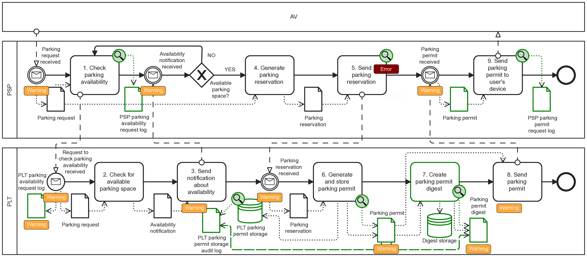
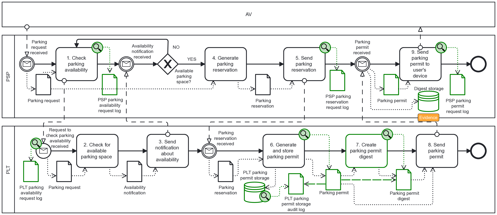

+++
title = "Assessment and Assurance"
type = "chapter"
weight = 4
+++

Assessment and assurance are both important parts of the design process. It addresses the evaluation of the Forensic Readiness Scenarios to determine the state of forensic readiness and the prioritisation for their enhancement. It also covers the techniques for validation of Forensic Readiness Requirements (i.e., whether they truly address the needs) and verifying their implementation (i.e., whether it is done correctly).

## Metrics

The Forensic Readiness Requirements describes a framework for using metrics for evaluating and verifying the requirements. However, specialised metrics are scoped on the Forensic Readiness Scenario. Based on BPMN4FRSS models, they can also be used for assessment purposes in the FR-ISSRM process .  First, the Scenario Coverage metric divides the model into components and computes a ratio of components covered by the potential evidence sources. Second, Relative Evidentiary Value approximates the quality of the evidence regarding its evidentiary value, i.e., how much it can be trusted. 

### Relative Evidentiary Value
Relative Evidentiary Value represents a quantitative estimate of evidentiary value placed on the Potential Evidence, within a Forensic Readiness Scenario, in terms of non-disputability. The metric considers the inherent reliability of the source, maintaining copies, and corroboration by others. In a sense, it is comparable to Casey’s evidence certainty metric . A higher relative evidentiary value signifies higher confidence in the resulting evidence, which is harder to dispute. However, it does not imply admissibility, which can be threatened by other circumstances, e.g., unexplained anomalies.

Relative Evidentiary Value is defined as a function $REV:E\to\mathbb{R}$, where $E$ denotes a set of Potential Evidence and $\mathbb{R}$ a set of real numbers. It consists of three components, defined as $B(e),L^{=}(e),L^{\neq}(e):E\to\mathbb{R}$ as:

$$
REV(e)=B(e)+L^{=}(e)+L^{\neq}(e)
$$
where the individual components are defined as follows. The first component $B(e)$ captures the base value regardless of other Potential Evidence. It is formulated as:
$$
B(e)=TR(e)\left|\mathcal{S}_{C}(e)\right|
$$
where $TR(e)$ represents the tamper resistance factor of the Evidence Source, inspired by the evidence certainty metric . Specifically, whether an unprivileged or privileged process can create the evidence. 
$$
TR(e)=\begin{cases}
1 & \text{Unprivileged creation}\\
2 & \text{Privileged creation}
\end{cases}
$$
Then, $\mathcal{S}_{C}(e)$ is a set of contexts $c\in C$ in which Potential Evidence $e\in E$ is stored.

$$
\mathcal{S}_{C}(e) = \{c \in C\text{ }|\text{ Potential Evidence }e\text{ is stored in context }\text{c}\}
$$

The context describes the properties of the environment where the Potential Evidence is stored and created. Contexts should be independent, so the violation of a single context should not mean the violation of another one. In BPMN4FRSS, the context is explicitly defined by a Pool.

Furthermore, the contexts also establish the notion of links, representing possible corroboration of Potential Evidence. Evidence links are the $L^{=}(e)$ and $L^{\neq}(e)$ components of REV. They represent the sum of base values from linked evidence in the same and different contexts, respectively. They are defined as:

$$
L^{=}(e) =\frac{\sum_{(e^\prime,e) \in L\wedge \mathcal{C_C}(e^\prime)=\mathcal{C_C}(e)}B(e^\prime)}{\left| \hat{C} \right|}
$$
$$
L^{\neq}(e) =\textstyle\sum_{(e^\prime,e) \in L\wedge \mathcal{C_C}(e^\prime)\neq \mathcal{C_C}(e)}B(e^\prime)
$$

Where $\hat{C}$ is a set of relevant contexts $\hat{C}\subseteq C$, that are directly participating in the scenario in question, without auxiliary ones (e.g., central log aggregator). Then, $L$ is a symmetric relation representing corroboration between two pieces of Potential Evidence and $\mathcal{C}_{C}(e)$ is a set of contexts $c\in C$ in which Potential Evidence $e\in E$ is created.
$$
L=\{(e,e^\prime)\text{ }|\text{ }e\text{ corroborates }e^\prime\}
$$
$$
\mathcal{C_C}(e) = c : c \in C \wedge \text{evidence }e\text{ is created in context }\text{c}
$$
The metric favours corroboration from entirely independent sources (i.e., $L^{\neq}(e)$) if they are available. Yet, it still rewards the corroboration in the same context (i.e., $L^{=}(e)$) but with a reduced value proportional to the number of relevant contexts. As a result, REV is strictly scoped to the particular Forensic Readiness Scenario (or its variants). The value is not comparable between different Forensic Readiness Scenarios.

### Scenario Coverage
Scenario Coverage describes the extent to which a Forensic Readiness Scenario is covered by Potential Evidence. I.e., it states how much of the scenario is covered by Potential Evidence sourced from the IS Assets involved in the scenario. The idea behind the metric is to estimate whether there is enough Potential Evidence to determine if the scenario was performed as expected.

The metric directly utilises the Forensic Readiness Scenario represented in BPMN4FRSS notation. The metric divides the model into components. Each component is a continuous sequence of Flow Objects connected by Sequence Flow within a single Pool. A Message Event or Send Task interrupts the component. An example of BPMN with four components is in Figure 1.


*Figure 1: BPMN4FRSS example of four Forensic Readiness Scenario components.*

Formally, the metric is defined as a function $SC:S\to[0,1]$, where $S$ denotes the set of Forensic Readiness Scenarios. It is defined as a ratio of components which contains Evidence Sources $\mathcal{\hat{K}}(s)$ and all components $\mathcal{K}(s)$ of the given scenario $s\in S$. The metric and its component functions $\mathcal{\hat{K}},\mathcal{K}:S\to K^*$ are defined as follows:

$$
SC(s) = \frac{\left| \mathcal{\hat{K}}(s) \right|}{\left| \mathcal{K}(s) \right|}
$$
where
$$
\mathcal{K}(s) =\{ k\in K\text{ }| \text{ component } k \text{ is in scenario } s\}
$$
$$
\mathcal{\hat{K}}(s) =\{ k\in K\text{ }| \text{ component } k \text{ containing}\text{ evidence source is in scenario } s\}
$$

The metric serves as a quick assessment of blind spots and allows comparison of evolving Forensic Readiness Scenario models. However, it has several limitations. It does not consider branching (i.e., Gateways) and the relevance of the components. Additionally, it does not differentiate between the Potential Evidence nor consider their importance or reliability.

## Rule-Based Analysis

Rule-based verification also utilises the BPNM4FRSS models as its input. It is implemented as part of the [FREAS](https://freas-tools.github.io/wiki/) tool and integrated into the modelling workflow . The analysis is based on Z3 SMT Solver  to check the correctness of BPMN4FRSS models, propose enhancements to the models, and answer queries. Thus, the tool allows for analysis and verification of the forensic-ready software systems based on satisfiability checking of logic formulas derived from the BPMN4FRSS models themselves.

The tool has three Validity, Hint, and Evidence Quality analysis types, corresponding to three sets of statements, defined as various first-order logic formulas in combination with background theories . It first derives facts parsed directly from the model, which transforms the BPMN4FRSS model into first-order logic formulas. Then, every analysis checks for the satisfiability of a different set of statements, reflecting syntactical and semantical rules of BPMN4FRSS models, recommendations, and queries. An example statement of Validity analysis would be:
```
All Evidence Sources have a 'Produces' association.
```
However, because the Z3 solver checks for satisfiability, the rule must be negated to produce a meaningful result. Thus:
```
There is an Evidence Source that does not have a 'Produces' association.
```
If satisfiable, then Z3 shall produce a solution that contains the elements breaking the original statement. In this example, it finds the specific Evidence Source. Thus, it can pinpoint exactly the part of the BPMN4FRSS model of interest. If the formulas are unsatisfiable, the statement is not broken, or the query does not produce any result. See the [FREAS source code](https://github.com/FREAS-tools/freas-analyzer-validity) for the full overview of implemented statements.

**Validity Analysis** is based on the BPMN4FRSS syntactic and semantic rules. These are transformed into first-order logic formulas with background theories and then negated. Thus, the formulas represent statements which should not be satisfiable with a valid BPMN4FRSS. If satisfied, it points out incorrectly constructed parts of the model or parts that are well constructed but do not make sense in what a BPMN4FRSS model represents.

**Hint Analysis** works similarly to the Validity Analysis. However, the semantics of the checked statements are different. Instead, the statements represent model “smells”, recommendations, and good practice. I.e., they identify where the model can be improved or that a forensic readiness control is not designed effectively. Thus, they give the analyst quick feedback, pointing out parts that should be re-examined and what they should consider.


*Figure 2: FREAS — Validity and Hint Analysis Example *

FREAS visualises the results of Validity and Hint Analysis directly on the model. Figure 2 is an example of an analysed model. A red label ”Error” denotes an element with a validity error, and an orange label ”Warning” denotes a hint regarding the element. The labels show detailed messages describing the problem in more detail.

Evidence Quality Analysis focuses on checking whether the modelled system can post-mortem detect a security risk occurrence. I.e., whether there would be usable evidence within the system to prove the impact of the risk. The reasoning is that a risk that impacts and compromises a part of a system (IS Asset) also affects the related potential evidence. If unaccounted for, it might lead to incorrect conclusions and interfere with the forensic investigation.

The analysis allows for what-if queries on the BPMN4FRSS model. The queries consider the effects of compromise of a selected part of a system and its effects on Potential Evidence. The formulas reflect various relationships derived from the BPMN4FRSS model and account for the satisfiability of negated statements over these relationships. Specifically, it focuses on formulas that are satisfied with Evidence Stores that hold data and can help detect inconsistencies in the Potential Evidence. If there are none, the model should be enhanced as needed.

Thus, the analysis indirectly refers to the evidentiary value, supporting admissibility . The higher value indicates higher confidence in the resulting evidence, making it more challenging to dispute. Thus, it reflects the corroborability of potential evidence .


*Figure 3: FREAS — Evidence Quality Analysis Example *

The Evidence Quality Analysis checks the relations between the Potential Evidence and their place in the process to determine which potential evidence could be used to spot a discrepancy. It could be missing or extra data, or a value difference. Notably, the analysis reports where the potential evidence can be found and where it can be retrieved (Evidence Store). Figure 3 is an example of an analysed model, showing Evidence Store with supporting Potential Evidence.

## Simulated Incident Exercise

The last assurance method follows up on the Mapping segment of the Forensic-Ready Design Approach. However, instead of considering the design of the system through a modelled forensic readiness scenario, it utilises empirical data from existing systems . This assurance approach is fitting in cases where the system is already running, there is limited visibility into the systems, or there is a lack of detail in the Forensic Readiness Scenarios.

As a prerequisite, the FR-ISSRM concepts are instantiated from available knowledge (e.g., Assets and Risks) to the extent possible. Then, the stakeholders' incentives (e.g., Forensic Readiness Goals and Scenarios) are included, along with any recognised notion of Potential Evidence.

Based on the established information, a simulated incident can be planned. The incident is sourced from a combination of Forensic Readiness Scenarios, laying down expected evidence that is presumed to be available and used. The incident is then executed in a controlled manner, and a responsible team is tasked with its investigation. During the investigation, the communication, actions taken, secured evidence, and results are noted.

The collected data are then assessed regarding the forensic readiness qualities of the system and the team. Found shortcomings are then reported to be treated by formulating forensic readiness requirements. The method tests the system by facing an investigation, thus uncovering hidden, unaccounted issues.

## References

