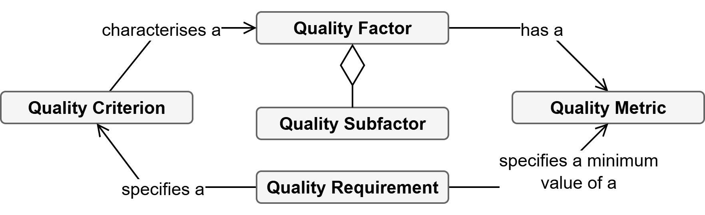
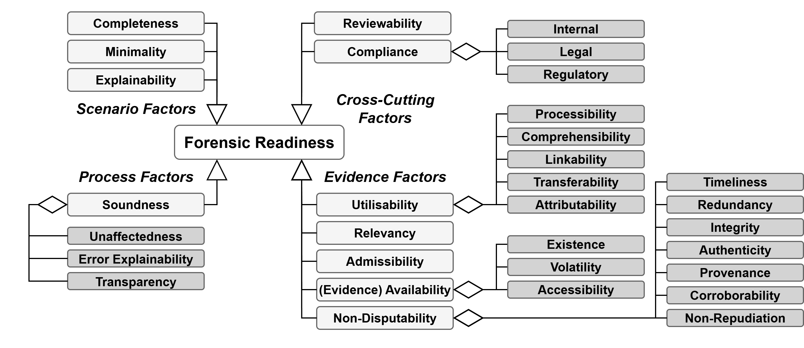

+++
title = "Forensic Readiness Requirements"
type = "chapter"
weight = 2
+++

A key step in the design process is formulating the exact requirements of forensic-ready software systems. As defined in the FR-ISSRM domain model , these are the conditions the system must satisfy to meet the Forensic Readiness Goal. They enhance Forensic Readiness Scenarios to improve the forensic readiness capabilities. Typically, the requirements refer to the system directly. However, requirements to improve the investigation regarding the particular Forensic Readiness Goal, indirectly involving the system, can be formulated as well (e.g., documentation, operational practice). Still, these indirect improvements have a positive effect on investigating the Forensic Readiness Scenarios.

Typically, the requirements are concerned directly with the potential evidence. Primarily, ensuring its existence and, transitively, its availability for the investigation. However, they can also relate to its quality in terms of non-disputability, like integrity, authenticity, and timelines.

## Forensic Readiness Requirement Factors

In the context of software systems, forensic readiness requirements are considered non-functional or qualitative features. Firesmith  defines such a quality requirement as a quality criterion, which characterises a quality factor (i.e., attributes, characteristics, properties) and a minimum value of the factor’s quality metric. Furthermore, the factors can be decomposed into components (subfactors). Implementation of such quality requirements (i.e., controls) can then be verified. The discussed Firesmith’s quality model is visualised in Figure 1.

*Figure 1: Firesmith’s Quality Model *

In other words, a forensic readiness requirement can be characterised as a measurable criterion of a specific factor. For example, “A web successful request log shall be linked with at least one other log on the API”. Thus, the requirement can be formulated very precisely, resolving a particular weakness of the Forensic Readiness Scenario, and verified using a metric. In the presented case, it refers to the linkability of the potential evidence and is measured by the number of likeable potential evidence.

The factors of forensic readiness are organised into four groups. These groups are as follows:
* **Evidence Factors** – Qualities relating to a single piece of potential evidence.
* **Scenario Factors**  – Qualities of a specific set of potential evidence, which refers to a particular forensic readiness scenario.
* **Process Factors** – Qualities of the digital forensic investigation process that can be affected by proactive measures.
* **Cross-Cutting Factors** – Qualities influencing forensic readiness in general, or they address a principle applicable to other factor groups.

The groups bundle the qualitative factors themselves. Then, several factors are further decomposed into subfactors which share a common aim. Fulfilment of the compound factors is possible by the combination of the subfactors. 
Figure 2 presents the full forensic readiness quality factor model. The model serves as a reference for formulating precise forensic readiness requirements . The following sections discuss the factors one by one.

*Figure 2: Forensic Readiness Requirements Factor Model *

### Evidence Factors
The evidence factors are a group of qualities of a single piece of potential evidence, essentially any information that can support legal proceedings, demonstrate due diligence, manage the impact of risk, and support a claim or dispute . Therefore, its qualities should be aligned with such actions, especially in being convincing to a 3rd party.

Digital evidence is commonly associated with legal context  and is obliged to follow legal requirements. While they differ based on the legal framework , they do follow common principles . However, proactively collected "potential" evidence can be, in many cases, more lenient, as it is not (yet) in the scope of a formal investigation. Still, high-quality potential evidence greatly improves the evidentiary value of the proper evidence when it is required.

**Non-Disputability** addresses the prevention of disputes regarding the potential evidence. In this sense, the fundamental disputes aim at admissibility, i.e., acceptance in a court of law. In other words, it provides assurances about the authenticity of potential evidence. Generally, the purpose of non-disputability in forensic readiness is to safeguard the evidentiary value of the data and increase its confidence . Consequently, non-disputability should allow for confident disputation of non-genuine potential evidence. It concerns the possible dangers of tampering or corruption of (potential) evidence .

As a result, the non-disputability of the potential evidence influences its evidentiary value. It is further decomposed into subfactors that complement and potentially substitute for one another. For example, even if the potential evidence is not protected against tampering (Integrity), it could have high value due to multiple independent pieces of evidence supporting it (Corroborability) . It is usually referred to as "Non-Repudiation" , but we instead consider Non-Repudiation as a factor closer to security and capture it here only as a subfactor.

*Timeliness* addresses the accuracy of the time of origin, or generally, any time information associated with the potential evidence. It motivates a timely creation of potential evidence relative to an action or event and assurance of the correctness of the time information. The reliability of the time is related to the Integrity  or can be corroborated by other time information.

*Redundancy* addresses the extent and manner of storing duplicities of potential evidence. It is related to Integrity as a way to provide integrity assurance and Corrborability as the copy corroborates the original and vice versa .

*Integrity* addresses the assurance that the potential evidence was not tampered with . In other words, it addresses the non-disputability of potential evidence corruption based on its unauthorised creation, modification, or deletion. It directly relates to integrity in a security sense .

*Authenticity* addresses the non-disputability of the potential evidence's origin. It relates to Authentication from a security perspective, which often implies Integrity . Additionally, authenticity might relate to Attributability, concerning binding the person or device of origin, but must give stronger guarantees, making the attribution non-disputable.

*Provenance* addresses the record-keeping of the actions on potential evidence during its lifecycle. This includes origin, transportation, modification, accessing, and processing records . A specific example of provenance in a forensic readiness sense is proactive maintenance of the chain of custody, which is mandatory for true digital evidence . It relates to auditability, albeit in a narrower sense, focusing strictly on the potential evidence lifecycle to achieve non-disputability.

*Corroborability* addresses the degree of support by a different, ideally independent, potential evidence. High corroborability enhances the overall non-disputability (i.e., certainty) of potential evidence . It is based on the assumption that the corruption of one would be detectable by others. Moreover, an undetectable corruption of one should require the corruption of another. It relates to Linkability, albeit in a narrower sense, focusing on the non-disputability.

*Non-Repudiation* addresses the extent to which any aspect of potential evidence is prevented from repudiation. Thus, there is a significant overlap with the non-repudiation from a security perspective . As noted, non-repudiation for digital evidence is often a synonym for the whole non-disputability . However, here it is considered as part of it, as the ability of one party to repudiate potential digital evidence arguably does have an impact on disputes.

**Evidence Availability** addresses the extent of potential evidence availability during an investigation. It encompasses the existence, preservation, and ability to retrieve the potential evidence . Typically, the requirements specify which, where, and when the potential evidence is created, what it should contain, and its retention.

*Existence* addressing the actual presence of potential evidence. Existence refers to the evidence being created within the software system and a particular Forensic Readiness Scenario.

*Volatility* addressing the window of when it can be preserved or accessed. Essentially, it represents how long the potential evidence shall be available after it is created and before it is preserved.

*Accessibility*, addressing the ease of access for an investigator. It refers to how easy it is to preserve the potential evidence during an investigation.

**Admissibility** is concerned with acceptability in a court of law. Generally, admissibility is a set of legal tests a judge performs to assess the formal evidence . However, their exact nature is dependent on the legal framework. It could be considered the most important quality of digital evidence, typically involving the proper handling and Non-Disputability qualities. While it is not a primary concern of potential evidence, it might be considered based on its intended use.

**Relevancy** addresses the need for the potential evidence and its fitness in a forensic readiness scenario . From an investigation point of view, it specifies the ability of the potential evidence to support or refute investigation hypotheses . Thanks to the mapping of scenarios, the relevancy addresses the specific reason why it is preserved and its value. As such, it acts as a counterweight to privacy regulations, demanding that the evidence collection is not excessive by explicitly stating the reason and extent.

**Utilisability** addresses the assistance in the forensic investigation itself to ease the work of the investigator or cybersecurity response team. In other words, it is a factor that addresses the helpfulness and contribution of potential evidence to the effectiveness of the investigation. It refers to one of the principal aims of forensic readiness. Different aspects of the support are reflected by its subfactors.

*Processability* addresses the degree of ease of automated processing of the potential evidence. It concerns aspects like data format, which influences its effectiveness and reliability , but also the availability of tools to process it.

*Comprehensibility* addresses the knowledge that the potential evidence can provide to the investigation. In other words, the knowledge about the semantics of potential evidence. Arguably, the a priori knowledge of the information the potential evidence can provide (e.g., from documentation ), including its limits, can help accelerate the investigation. Additionally, it concerns possible errors  and allows validation of the results .

*Linkablility* addresses the degree to which the potential evidence can be linked or correlated with others. Presence and awareness of the existing links are essential in reconstructing events during the investigation. Moreover, strong linkability should allow for easier explorative analysis .

*Transferability* addresses the degree to which the potential evidence can be transferred to another custody. Typically, the evidence is transferred to local law enforcement based order for evidence release . However, the release might also demand a cross-border or cross-organisational transfer. It concerns the ease of the transfer, including the need for supplementary material and privacy.

*Attributability* is a factor describing the degree of ability to bind potential evidence with an entity, meaning a person, device, place, or application. Specifically, establishing attributability to a person is considered highly important .

### Scenario Factors

The scenario factors are a group of qualities of a set of potential evidence referring to a particular forensic readiness scenario . In contrast to the qualities of single potential evidence, these factors address how well they work together towards forensic readiness.

**Completeness** addresses the degree to which the scenario includes sufficient potential evidence for its investigation. From an investigation point of view, it specifies whether the potential evidence is sufficient to support or refute investigation hypotheses .

**Minimality** addresses the degree to which the scenario includes only the potential evidence important for the investigation. Its purpose is to limit the amount of potential evidence an investigator must go through . Essentially, it refers to a proactive forensic triage .

**Explainability** addresses the degree of the ability to explain conclusions based on the scenario clearly . It deals with the number of phenomena that could be effectively described and the manner of doing so.

### Process Factors

The process factors are a group of qualities of the digital forensic investigation process, scoped on those that can be reasonably affected by proactive measures. As such, it refers to the qualitative factors of forensic-ready software systems conducting forensic processes .

**Process Soundness** addresses the degree of soundness of the conducted forensic processes. In other words, it deals with the assurance that the process does not diminish the value of potential evidence . It is further specified by subclasses focusing on a different part of soundness.

*Unaffectedness* addresses the degree of assurance that the conducted processes do not affect the meaning or interpretation of the potential evidence.

*Error Explainability* addresses the degree to which the errors in the forensic process can be detected and explained.

*Transparency* addresses the degree to which the process can be re-examined and verified by an independent party.

### Cross-Cutting Factors

The cross-cutting factors are a group of qualities influencing forensic readiness in general, or they address a principle applicable to all other factor groups. For example, Legal Compliance must be accounted for in virtually all aspects of a forensic-ready software system.

textbf{Reviewability} addresses the degree to which the system’s actions, components, or data involving potential evidence and forensic processes support audit and legal review. The goal is twofold. The first is to enable legal advice on an incident . The second is allowing the inspection of forensic-ready controls to analyse nominal and abnormal behaviour in a similar sense to security auditing . That could result in meta-potential evidence, similar to Provenance.

**Compliance** addresses the degree to which is the forensic-ready software system compliant with the law, regulations, or organisational policies . It is further specified by subfactors focusing on the specific part, namely *Legal*, *Regulatory*, and *Local*. The factor places constraints on others. For example, demand a level of Transferability to law enforcement, or on the other hand, forbid the existence of potential evidence.

## References

