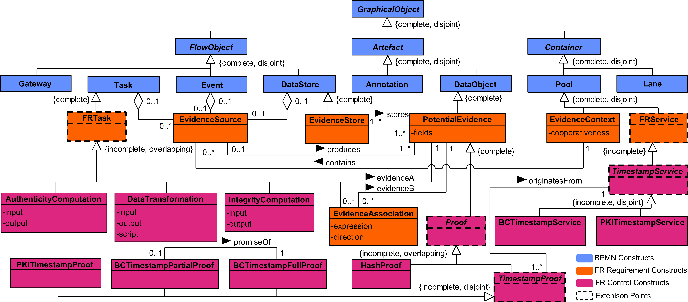
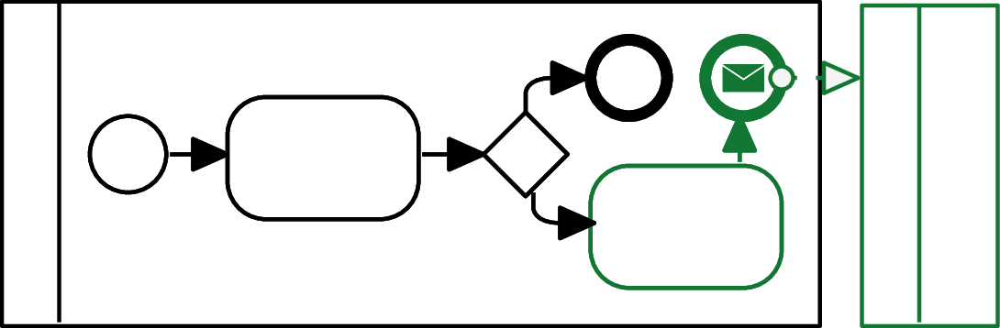
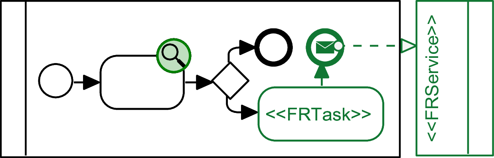
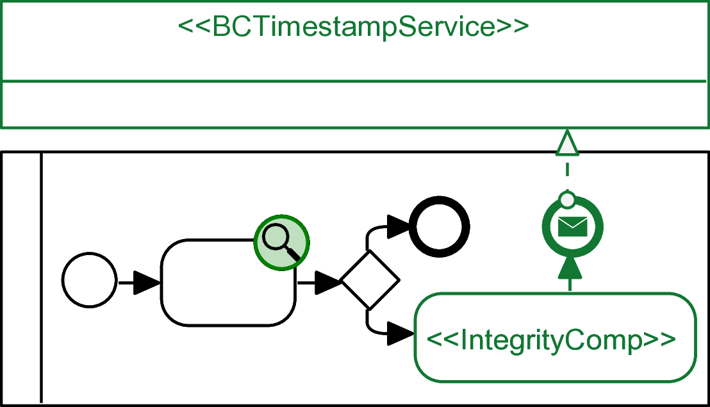

+++
title = "Modelling"
type = "chapter"
weight = 3
+++

Modelling supports the Forensic-Ready Design Approach by producing tangible artefacts during the design process. Typically, there are, but are not limited to, graphical diagrams. These diagrams capture different aspects and viewpoints of the system. The artefacts enable reasoning about the alternatives and effects. Such properties were already explored in the security risk management context . Additionally, the models can also be used for design validation and evaluation .

In the context of the discussed Forensic-Ready Design Approach, Business Process Model and Notation (BPMN) models  are supported as the primary modelling approach. Thus, this chapter presents BPMN for Forensic-Ready Software Systems (BPMN4FRSS) models . They serve as a reference modelling language for the Forensic-Ready Design Approach. First, it demonstrates the alignment of forensic readiness concepts into models, allowing possible adoption towards other modelling languages. However, they also demonstrate the model-based evaluation and assurance .

The BPMN's strength lies in capturing the dynamic nature of Forensic Readiness Scenarios, and its rich semantics are useful for validation or evaluation. At the same time, they remain abstract, focusing on the processes within the system and not the technical details, allowing for a higher-level perspective.

On the other hand, the BPMN should not be taken as the only possible approach. It does not capture the static architectural perspective and underlying technology, both of which are also important for forensic readiness. Additionally, the level of abstraction might be confusing, especially combined with the BPMN syntax and semantics.

## Business Process Model and Notation

The basis of the modelling notation is Business Process Model and Notation (BPMN), which is a well-known modelling language standardised by Object Management Group . Syntactically similar to the flow charts, it has a rich semantic model . Figure 1 is an example of a BPMN diagram with common constructs used in a forensic readiness context.

*Figure 1: Example BPMN Diagram*

The diagram in Figure 1 comprises two Pools (User device and Service provider). Each Pool contains a process instance, where Flow Objects are connected exclusively by Sequence Flows within the same Pool. Interactions between the two processes are represented by Message Flows, which explicitly denote information exchanges across Pool boundaries.

The primary Flow Object is the Task (e.g., Send request for registration), which models an atomic activity. In contrast, a Sub‑Process (e.g., Validate the registration request) encapsulates a compound activity. Sub‑Processes provide hierarchical structuring and allow complex behaviour to be abstracted into a single Flow Object.

Events (represented as circles) constitute another core Flow Object and appear in specialised forms depending on their position in the process and their triggering semantics. A Start Event initiates a process instance, with the Message Start Event (Request for registration received) variant requiring the arrival of a specific message to trigger execution. An End Event terminates the process flow. Intermediate Events occur between activities and may impose additional behaviour. For example, a Message Intermediate Event (Parking service credential received) requires an incoming message before the process can resume.

A Gateway (a diamond) functions as a control-flow construct used to regulate the divergence and convergence of Sequence Flows. Gateways enable conditional branching, parallelisation, or merging of execution paths based on defined logic.

Data exchanged between Events and Tasks is represented by a Data Object (e.g., Registration data), whose lifecycle is bound to the specific process instance. Persistent data, by contrast, is modelled using a Data Store (e.g., Credential storage), which denotes data that exists independently of any single process instance. The connections between Flow Objects and data Artefacts are expressed through Data Associations, which specify the direction and nature of data usage.

The original purpose of BPMN is the modelling of an organisation’s business processes, including those within information systems. As shown in , the BPMN constructs can be aligned with the security risk management domain through ISSRM. Specifically, flow objects (e.g., tasks, events, and gateways) represent the assets (both business and IS assets). They are organised into containers (i.e., pools and lanes) that describe the execution environment and thus the various components of the information system. Additionally, this Secure Risk-Oriented BPMN  further specifies constructs for risk, represented as a “negative” process.

## BPMN for Forensic-Ready Software Systems

### Syntax

The abstract syntax captures all concepts of the language and its relationships, which also includes structural semantics . In the case of BPMN4FRSS, the extended forensic readiness constructs are based on FR-ISSRM and are aligned with the BPMN abstract syntax . Figure 2 depicts the abstract syntax of the BPMN4FRSS extension.

*Figure 2: BPMN4FRSS Abstract Syntax *

The BPMN4FRSS constructs are divided into two successive levels: requirements and controls. Requirements constructs represent the FR-ISSRM Forensic Readiness Requirements, which are abstract enhancements of a Forensic Readiness Scenario.  Controls constructs represent the FR-ISSRM Forensic Readiness Controls, which are the specific implementation of requirements. As they describe the utilisation of concrete technology, BPMN4FRSS is inherently incomplete and explicit extension points are provided to accommodate further controls.

#### Requirement Constructs
The primary element is the Evidence Source, representing the origin of evidence within a process. It can be attached to a BPMN Task, Event, or Data Store. Each Evidence Source generates one or more Potential Evidence instances, modelled as BPMN Data Objects. Each Potential Evidence must have exactly one Evidence Source. Instances of Potential Evidence may be linked through an Evidence Association, which specifies relational conditions (e.g., field equivalence) and optional temporal ordering (e.g., A precedes B). An Evidence Store, a specialised BPMN Data Store, is a persistent repository for storing Potential Evidence, possibly redundantly. All the elements are contained within the BPMN Pool, defined as an Evidence Context, providing contextual metadata.

Two additional constructs extend beyond FR‑ISSRM concepts to model forensic‑readiness capabilities. An FR Task is a specialised BPMN Task representing an abstract atomic activity supporting forensic readiness (e.g., generating a proof of integrity). An FR Service is a specialised BPMN Pool representing an external participant providing forensic readiness functionality (e.g., a notary service).

#### Control Constructs
The second layer of BPMN4FRSS defines constructs for modelling concrete technologies to represent FR ISSRM Forensic Readiness Controls. This layer uses the extension points to incorporate new constructs. For example, specialisations of FR Task include Authenticity Computation and Integrity Computation, which generate proofs of authenticity or integrity. Their outputs are new Potential Evidence items that provide assurance about other evidence, linked through Evidence Associations. Their outputs are an abstract Proof, which can be further specialised. For instance, a Hash Proof results from an Integrity Computation that produces a cryptographic hash to verify integrity. Another specialised FR Task, Data Transformation, documents and validates transformations to preserve the semantic meaning of Potential Evidence.

Specialised FR Services may also define specialised Proof types. A representative example is a blockchain timestamping service (e.g., OpenTimestamps), modelled as a BC Timestamp Service, which produces a BC Timestamp Partial Proof (a preliminary temporal receipt) and a BC Timestamp Full Proof once the timestamp is committed to the blockchain. The different proofs represent different degrees of non-disputability.

#### Concrete Syntax

The BPMN4FRSS concrete syntax is implemented through dedicated visual elements and stereotypes that extend existing BPMN constructs, with additional stereotype parameters defined through non-visual attributes. This approach follows the principles of UML profiles, where stereotypes and tagged values provide a structured mechanism for enriching a base modelling language without altering its core semantics. To improve diagram readability, the notation adopts an optional green colour scheme to distinguish BPMN4FRSS constructs from standard BPMN elements.

### Semantics

To ensure correct interpretation of the BPMN4FRSS models with respect to the design approach and FR-ISSRM, a semantic mapping is provided . Thus, forensic-ready risk management can benefit from the models serving as the process artefacts. Furthermore, a precise definition of how the FR-ISSRM concepts are represented is required for further assessment, reasoning, and assurance.

A prior semantic mapping between ISSRM concepts and extended BPMN exists in the Security Risk Oriented BPMN []. Its focus is on modelling practices for security risk management, adding new visual elements and characteristics, but it does not modify BPMN semantics. BPMN4FRSS extends this mapping to incorporate FR ISSRM concepts, as summarised in Table 1.

*Table 1: Semantic mapping between FR-ISSRM domain model and BPMN4FRSS syntax*
| **FR-ISSRM Concept** | **Concrete Syntax** | **Note** |
|----------------------|---------------------|----------|
| Evidence |  | Stereotyped Data Object |
| Evidence Source |  | Evidence Source attached to Task, Data Store, or Event |
| Evidence Store |  | Stereotyped Data Store |
| *Creates* |  | Produces association between Evidence Source and Potential Evidence |
| *Evidence Store <>-- Evidence* | - | Stores association between Evidence Store and Potential Evidence |
| *Corroborates* |  | Evidence Association with direction from Potential Evidence to Potential Evidence |
| Forensic Readiness Goal |  | Annotation |
| *Claim on* |  | Annotation associated with Task or Data Object |
| *Facilitates* | - | - |
| Forensic Readiness Scenario |  | Process or its fragment |
| Forensic Readiness Treatment | - | - |
| *Decision to treat* | - | - |
| Forensic Readiness Requirement + *Enhances* |  | Process or its fragment containing requirement constructs |
| *Refines* | - | - |
| Forensic Readiness Control |  | Process or its fragment containing requirement constructs and control constructs |
| *Implements* | - | - |

In this mapping, the FR ISSRM Evidence Source is an IS asset representing the origin of evidence, modelled as a dedicated visual element attached to a Task, Event, or Data Store. It provides both asset identification and a temporal context to the evidence. Conversely, the Evidence Store is an IS asset for persistent evidence storage and is represented as a stereotyped Data Store. The Potential Evidence is a Business Asset, which corresponds to a stereotyped Data Object. Its relations are represented with an arrow to the Evidence Source (Creates), and a list attribute to the Evidence Store (the aggregation), signifying that the Evidence Store contains the Potential Evidence.

Both the Evidence Source and Evidence Store are context-dependent. FR ISSRM captures this through the notion of cooperativeness, describing the accessibility of potential evidence before and during an investigation. BPMN4FRSS expresses cooperativeness as an attribute on a stereotyped Pool, the native container for BPMN processes. The attribute supports three values: Non Cooperative (evidence inaccessible), Cooperative (evidence accessible), and Semi Cooperative (accessibility conditional or partially constrained).

A main use of BPMN4FRSS is to model Forensic Readiness Scenarios. This FR ISSRM concept corresponds to a combination of Pools and their contained Graphical Objects, namely Potential Evidence. A scenario must include elements corresponding to a Risk, which is expressed with Security Risk Oriented BPMN . The last component of the Forensic Readiness Scenario is the Forensic Readiness Goal. It is mapped by an Annotation on a Graphical Object representing a Business asset, signifying the claim on the Business asset.

Finally, BPMN4FRSS enables modelling of Forensic Readiness Treatments, covering both requirements and controls. Forensic Readiness Requirements are mapped to combinations of Flow Objects and BPMN4FRSS requirement constructs. Forensic Readiness Controls extend this mapping by incorporating BPMN4FRSS control constructs, which capture the technical implementation details.

In addition, the BPMN4FRSS defines a set of semantic rules. They ensure the correctness of the models, beyond syntactical restrictions. These are especially relevant for the proper representation of Forensic Readiness Controls. Therefore, extensions should also provide new rules in addition to syntactic constructs. Table 2 presents the rules.

*Table 2: BPMN4FRSS semantic rules *
| Rule |
|------|
| *Data Objects* and *Data Stores* with the same name in a single model namespace are considered the same object for all intents and purposes. |
| Non‑cooperative *Evidence Context* cannot contain *Evidence Sources* or *Evidence Stores*. |
| *Hash Proof* must be an output of an *Integrity Computation Task*. |
| *PKI Timestamp Proof* must be the output of an *Event* or *Task* receiving a *Message Flow* directed to it from a *PKI Timestamp Service Pool*. |
| *BC Timestamp Partial Proof* must be the output of an *Event* or *Task* receiving a *Message Flow* directed to it from a *BC Timestamp Service Pool*. |
| *BC Timestamp Full Proof* must be the output of an *Event* or *Task* receiving a *Message Flow* directed to it from a *BC Timestamp Service Pool*. |
| *BC Timestamp Full Proof* which is a *promise of* a *BC Timestamp Partial Proof* must both *originate from* the same *BC Timestamp Service Pool*. |

### Tool Support

The BPMN4FRSS is supported by FREAS, a modelling and analysis tool for forensic-ready software systems . The tool allows importing existing business processes or modelling new ones and enhancing them with BPMN4FRSS elements. Furthermore, it implements different types of analyses based on the information from BPMN4FRSS models. For example, it involves checking the semantic rules and assessing the modelled system's ability to provide high evidentiary value in the event of an incident. 

See the [FREAS Wiki](https://freas-tools.github.io/wiki/) for more details.

## References

