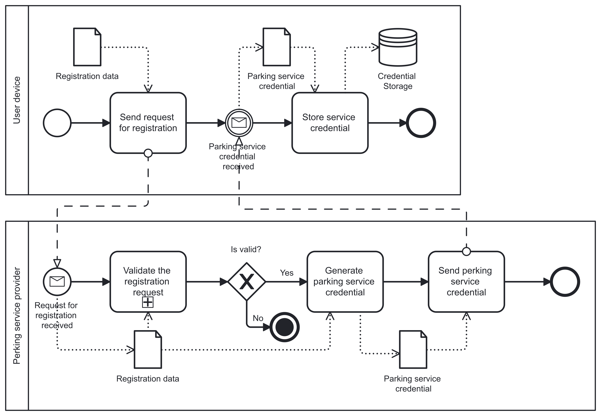

+++
title = "Modelling"
type = "chapter"
weight = 3
+++

Modelling supports the Forensic-Ready Design Approach by producing tangible artefacts during the design process. Typically, there are, but are not limited to, graphical diagrams. These diagrams capture different aspects and viewpoints of the system. The artefacts enable reasoning about the alternatives and effects. Such properties were already explored in the security risk management context. Additionally, the models can also be used for design validation and evaluation.

In the context of the discussed Forensic-Ready Design Approach, Business Process Model and Notation (BPMN) models are supported as the primary modelling approach. Thus, this chapter presents BPMN for Forensic-Ready Software Systems (BPMN4FRSS) models. They serve as a reference modelling language for the Forensic-Ready Design Approach. First, it demonstrates the alignment of forensic readiness concepts into models, allowing possible adoption towards other modelling languages. However, they also demonstrate the model-based evaluation and assurance.

The BPMN's strength lies in capturing the dynamic nature of Forensic Readiness Scenarios, and its rich semantics are useful for validation or evaluation. At the same time, they remain abstract, focusing on the processes within the system and not the technical details, allowing for a higher-level perspective.

On the other hand, the BPMN should not be taken as the only possible approach. It does not capture the static architectural perspective and underlying technology, both of which are also important for forensic readiness. Additionally, the level of abstraction might be confusing, especially combined with the BPMN syntax and semantics.

## Business Process Model and Notation

The basis of the modelling notation is Business Process Model and Notation (BPMN), which is a well-known modelling language standardised by Object Management Group. Syntactically similar to the flow charts, it has a rich semantic model. Figure 1 is an example of a BPMN diagram with common constructs used in a forensic readiness context.

*Figure 1: Example BPMN Diagram*

The diagram in Figure 1 comprises two Pools (User device and Service provider). Each Pool contains a process instance, where Flow Objects are connected exclusively by Sequence Flows within the same Pool. Interactions between the two processes are represented by Message Flows, which explicitly denote information exchanges across Pool boundaries.

The primary Flow Object is the Task (e.g., Send request for registration), which models an atomic activity. In contrast, a Sub‑Process (e.g., Validate the registration request) encapsulates a compound activity. Sub‑Processes provide hierarchical structuring and allow complex behaviour to be abstracted into a single Flow Object.

Events (represented as circles) constitute another core Flow Object and appear in specialised forms depending on their position in the process and their triggering semantics. A Start Event initiates a process instance, with the Message Start Event (Request for registration received) variant requiring the arrival of a specific message to trigger execution. An End Event terminates the process flow. Intermediate Events occur between activities and may impose additional behaviour. For example, a Message Intermediate Event (Parking service credential received) requires an incoming message before the process can resume.

A Gateway (a diamond) functions as a control-flow construct used to regulate the divergence and convergence of Sequence Flows. Gateways enable conditional branching, parallelisation, or merging of execution paths based on defined logic.

Data exchanged between Events and Tasks is represented by a Data Object (e.g., Registration data), whose lifecycle is bound to the specific process instance. Persistent data, by contrast, is modelled using a Data Store (e.g., Credential storage), which denotes data that exists independently of any single process instance. The connections between Flow Objects and data Artefacts are expressed through Data Associations, which specify the direction and nature of data usage.

The original purpose of BPMN is the modelling of an organisation’s business processes, including those within information systems. As shown in, the BPMN constructs can be aligned with the security risk management domain through ISSRM. Specifically, flow objects (e.g., tasks, events, and gateways) represent the assets (both business and IS assets). They are organised into containers (i.e., pools and lanes) that describe the execution environment and thus the various components of the information system. Additionally, this Secure Risk-Oriented BPMN further specifies constructs for risk, represented as a “negative” process.

## References

