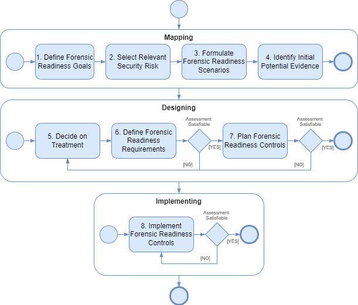
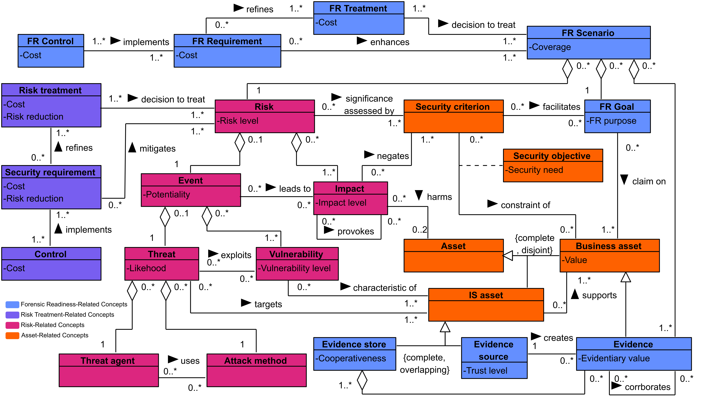

+++
title = "Risk-Oriented Process"
type = "chapter"
weight = 1
+++

Embedding forensic-ready features into the systems not only makes them secure but also accountable, prepared, and analysable when incidents occur . However, creating such forensic-ready software requires collaboration between security analysts and software designers.

The approach requires an analyst who evaluates systems through the perspective of information security, considering assets, risks, and security criteria . Then, they formulate forensic readiness goals and concrete scenarios to analyse the systems from a forensic readiness perspective. Identifying weak points of the systems is the basis for the software designer to find a way to resolve them.

## Prerequisites

The forensic-ready software system design approach is risk-oriented, which means the design decisions are rooted in risks towards the system. It builds on the security risk management practices, as forensic readiness is, in a sense, complementary to security practices . Thus, the first step towards introducing forensic readiness into a software system is to follow up the secure software design. Specifically, the following needs to be known beforehand:
* Assets
* Security Criteria
* Risks

In other words, to know what should be protected, emphasising business (primary) assets (e.g., data, capabilities, processes, skills) and which system (technical, supporting) assets are supporting it. Security criteria are applied to those assets, describing a need (e.g., confidentiality, integrity, availability) . Also, be aware of what can happen, meaning an event with a negative impact on the assets.

This pre-step is needed for the cost-effective implementation of forensic readiness. In the design process, the risks influence the targeting and prioritisation of forensic readiness capabilities. Thus, the forensic readiness can be aimed at high-risk or residual-risk scenarios to complement the security controls, as needed. Furthermore, in-depth knowledge of assets and risks facilitates the elicitation of potential evidence.

## Process
The forensic-ready software system design approach is described by a process which describes the activities leading to the implementation of forensic readiness capabilities in software. Figure 1 depicts the overview of the process, divided into three segments: Mapping, Designing, and Implementing. 
 

*Figure 1: Forensic-Ready Design Approach Process*

In the first, Mapping, stage, the current state of the system is assessed with respect to the needs for forensic readiness. At the start (1), the forensic readiness goals are formulated. These encapsulate the overall aims of implementing forensic readiness in relation to the business (primary) assets. Whether it is supporting an investigation related to a specific asset, handling disputes, etc. The goals drive forward the rest of the process. Then (2), security risks relevant to the forensic readiness goals are selected. This means reviewing the recognised risks (from the security risk assessment), whether they fall under the goal. For example, the goal of enabling investigation of asset “sensor data” tampering would involve investigation of any occurrence of “sensor data” tampering risk. These goal-risk pairs are encapsulated into forensic readiness scenarios (3), which describe what happens to the system during risk occurrence, in relation to the goal. The scenarios are then enriched (4) with existing potential evidence, which gives testimony of the occurrence. Naturally, the discovery of the potential evidence is a complex and challenging task, which is a topic in itself. However, the scenarios are used to narrow the context.

The second stage, Designing, expands on the scenarios from the previous stage. Specifically, the scenarios are assessed (5) for inadequate coverage of the goal (i.e., gaps in forensic readiness). The inadequate scenarios are selected for treatment and potential enhancement. As it is probably infeasible to address all gaps, treatments are prioritised based on the goals and risks. Then, forensic readiness requirements are formulated (6), which enhances the scenarios. The requirements are assessed for satisfaction of the goal and cost effectiveness. If satisfiable, implementation of the requirements is planned (7), formulating the specific forensic readiness controls to be implemented. Again, an assessment is made to determine whether they satisfy the requirements and cost-effectiveness.

Finally, the last stage, Implementing, is focused on actually implementing the controls into the system (8). The implementation must also be assessed, if done correctly, and the requirements are truly satisfied. 

The presented process frames and sequences the decisions during the design and development. Thus, a specific implementation strategy should be driven by the organisation’s development process. As such, the stages could be reorganised. For example, making the planning and assessment of controls step (7) and implementation step (8) part of one iteration in the process.

Lastly, the whole process is meant to be iterative, meaning that multiple runs of the whole process or stages should be made, depending on the assessment. The described process only highlights some of the key decision points. For example, the Mapping stage can be performed multiple times, each time focusing on different risks, depending on the priorities and budget. Like the risks, the forensic readiness scenarios are not static and evolve in time. Thus, ideally, the process should be synchronised with security risk management and continuous.

## Domain Model
The concepts of the forensic-ready software system design approach are organised into the Forensic-Ready Information Systems Security Risk Management (FR-ISSRM) domain model . It is an extension of Information Systems Security Risk Management (ISSRM) , underlining the relationship between security and forensic readiness. The domain model is presented in Figure 2 as a UML class diagram.

*Figure 2: FR-ISSRM Domain Model*

The original ISSRM domain model  features three concept groups. (1) Asset-related concepts describing the important assets and criteria for their security. (2) Risk-related concepts describing the risk and its components. (3) Risk Treatment-related concepts, describing decisions, requirements, and implementations to mitigate the risks. The FR-ISSRM adds the fourth group: (4) Forensic Readiness-related concepts, describing the concepts specific to forensic readiness, including the potential evidence, its context, scenarios, and requirements for forensic-ready systems.

### ISSRM Concepts
Concepts from the original ISSRM that are relevant to forensic readiness are described here. For the full description of the concepts, see , which contains a detailed description of the ISSRM domain model.

**Asset** is anything that has value to the organisation and is necessary for achieving its objectives.

**Business Asset** (or Primary Asset as per ISO/IEC 27k) is a type of Asset describing information, processes, capabilities, and skills. They are essential for the organisation’s business objectives and mission. Typically, Business Assets are immaterial.

**Information System Asset** (IS Asset or Supporting Asset as per ISO/IEC 27k) is a type of Asset describing components of a system (e.g., hardware, software, network), but also people and facilities involved in its operation. Their role is to support the Business Assets. Notably, a single analysed IS Asset might be, in reality, composed of other IS Assets (e.g., a server containing multiple components), which are not detailed.

**Security Criterion** (or Security Property) characterises a security need and is a property or constraint on business assets. The security criteria describe the security needs, which are typically expressed as confidentiality, integrity and availability of Business Assets.

**Risk** is a combination of an Event and its Impact. Specifically, the Event represents an undesired occurrence (e.g., a cyberattack), and the Impact represents the negative consequence, which harms two or more Assets.

### Forensic Readiness-Related Concepts
The FR-ISSRM enhances the ISSRM domain model by introducing new concepts focused on assessing and establishing forensic readiness in software systems. These additions formally complement security risk management by proactively preparing for the investigation of potential incidents. The newly introduced FR-ISSRM concepts are defined as follows:

**Potential Evidence** is a specific kind of Business Asset, representing data potentially usable in a digital forensic investigation. The value of Potential Evidence to the organisation is in its role during the anticipated investigation of a Risk occurrence. It can be further corroborated by other Potential Evidence, which ultimately increases its reliability. Generally, any digital information can be considered Potential Evidence, but only that which is useful for an investigation should be considered.

**Evidence Source** is a specific kind of IS Asset where Potential Evidence originates. Representing the parts of a system that generate or create Potential Evidence. It is an important aspect of asserting the availability and evidentiary value, as different sources have different implications (e.g., the integrity of logs from a user device is based on the claims of that user, as opposed to web server logs under the organisation’s control).

**Evidence Storage** is a specific kind of IS Asset responsible for the persistent storage of Potential Evidence. A single Potential Evidence can be stored in one or more Evidence Storage, representing identical copies. Like the Evidence Source, Evidence Storage is an aspect of the availability and evidentiary value. It defines the extent to which the Potential Evidence shall be available for the investigation. The Evidence Storage can be the same as or different from the Evidence Source, as the Potential Evidence can be stored on a different IS Asset than the one that created it (e.g., remote logging).

**Forensic Readiness Goal** captures and expresses the purpose of implementing forensic readiness. It describes a claim towards a Business Asset, which can be supported or refuted using digital evidence. In other words, the Forensic Readiness Goal defines the question regarding a particular Business Asset that the investigation should answer. To further capture the nuances and aims, the Forensic Readiness Goal should specify the applicable legal framework (e.g., criminal or civil case), as this impacts the context of the evidence. Notably, any claims on IS Assets are defined through the Business Assets they support (e.g., a claim on an application is addressed by a claim on the capability for which it exists).

**Forensic Readiness Scenario** describes how the Forensic Readiness Goal is addressed, using the Potential Evidence and the Risk it covers. Formally, it is defined as a combination of the three concepts. The idea is that there is different Potential Evidence related to the Risk occurrence and relevant to different Forensic Readiness Goals. As a result, it includes only the Potential Evidence available and relevant for investigation regarding the Forensic Readiness Goal (i.e., answering the investigation question). Notably, the Potential Evidence that is part of the Forensic Readiness Scenario forms a partial ordering with respect to the creation time of the Potential Evidence.

**Forensic Readiness Scenario Treatment** is a decision on how to treat inadequacies in the Forensic Readiness Scenario. These inadequacies are coming from the assessment results. It expresses the course of action to meet the Forensic Readiness Goal by having sufficient Potential Evidence of sufficient quality that covers the Risk. Forensic Readiness Scenario Treatment is analogous to Risk Treatment in ISSRM, but it is scoped on the Forensic Readiness Scenario. Following the standard risk management categorisation , there are four categories:
* Scenario Avoidance – Avoid the Forensic Readiness Scenario from being relevant. This constitutes withdrawing from the Risk or Forensic Readiness Goal, thus invalidating it. Analogous to risk avoidance.
* Scenario Enhancement – Enhance the Forensic Readiness Scenario to sufficiently cover the Risk with respect to the Forensic Readiness Goal. The Forensic Readiness Requirements are formulated to specify the enhancement. Analogous to risk reduction.
* Scenario Retention – Accept the Forensic Readiness Scenario in its current form. No action is taken after this decision. Analogous to risk retention.
* Scenario Transfer – Completely transfer or share the burden of evidence on an eligible third party. The satisfaction of the Forensic Readiness Goal shall be a (partial) responsibility of that party. Analogous to risk transfer.

**Forensic Readiness Requirement** is a condition to be satisfied in the system to meet the Forensic Readiness Goal. In particular, the availability of Potential Evidence, its quality, and the coverage of the specific Forensic Readiness Scenario. Typically, the requirements refer to the software systems directly. However, requirements to improve the investigation regarding the particular Forensic Readiness Goal, indirectly involving the systems, can be formulated as well (e.g., documentation, operational practice).

**Forensic Readiness Control** is the specific implementation of Forensic Readiness Requirements within the software system, improving the forensic readiness capabilities. For example, it can include creating or modifying:
* Creating a new or modifying existing Potential Evidence. For example, adding new log records and enhancing their content to facilitate tracing.
* Adding a new or modifying the capabilities of the existing Evidence Store. For example, introducing remote storage.
* Adding a new or modifying the capabilities of the existing Evidence Source. For example, deploying a new auditing subsystem, introducing logging capability.
* Creating documentation for the purposes of forensic investigation. For example, a checklist of what must be done in incident handling and how.
* Establishing or modifying a policy or practice concerning the software system. For example, involving new tools in incident response and investigation.

## Beyond the Security Risks
In its grounding, the forensic readiness is focused on expanding security. However, in essence, it is not limited to it. A good example is forensic readiness from a safety perspective. Safety is traditionally concerned with unintentional incidents, while security is associated with intentional acts. Formally, the Safety Risk is a combination of an Accident and its Harm . Specifically, the Accident represents an undesired occurrence, and the Harm represents the negative consequence, which damages the Asset.

In terms of forensic readiness, instead of security risk, the safety risk would be included in the forensic readiness scenario. Thus, instead, the term risk in “Forensic Readiness Scenario describes how the Forensic Readiness Goal is addressed, using the Potential Evidence and the Risk it covers.” becomes a safety risk. However, the Forensic Readiness Goal needs to consider the investigation of the severity of Harms damaging the assets and, in general, finding the root causes of Accidents. The assessment strategy remains unchanged, as it is typically done on the Forensic Readiness Scenario-level. For the more fine-grained assessments, the concepts are replaced accordingly.

## References

